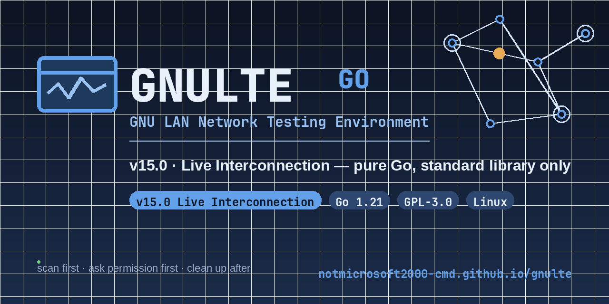

# GNULTE · Go edition

> **v16.6 — Unplugged** · the GNU LAN Network Testing Environment, rewritten in pure Go
> (standard library only, no external dependencies)


[](https://notmicrosoft2000-cmd.github.io/gnulte/)



GNULTE is a suite of focused Linux tools for measuring how devices behave when
their network misbehaves — on networks you own or are explicitly authorised to
test. Scan the LAN, shape a target’s traffic with real kernel `tc netem`,
watch every device live, and hand off from one tool to the next: the whole
toolkit shares one live view of your network.

## The five tools

| Binary | Root | What it does |
| --- | --- | --- |
| `gnulte` | **yes** | Interactive shaping engine — ARP-spoofed routing into `tc netem` (latency, jitter, loss, duplication, reordering, bandwidth), live dashboard, live `tc -s qdisc` telemetry, HTML report. Discreet `-S` stealth spoofing |
| `gnulte-lan` | optional | Live LAN watch with a **five-screen console** — hosts, talkers (ranked with bars & peers), flows (A ⇄ B, root socket), neighbours (ARP), and screen 5’s **Live Interconnection map** (devices as nodes, live flows as pulsing edges) |
| `gnulte-scan` | optional | Parallel sweep + in-Go deep port scanner — OUI vendor, mDNS/NetBIOS names, device types, OS fingerprinting, `-T` tabbed browser, and live re-scanning with `--watch N` |
| `gnulte-devices` | no | Instant ARP/neighbour inventory — vendors, mDNS hostnames, type guesses, HTML reports |
| `gnulte-wifi` | **yes** | Targeted 802.11 deauthentication for authorised Wi-Fi disassociation testing — per-frame jitter, rotating reason codes, channel hopping |

## Unplugged (v16.6+)

v17's **Unplugged** programme, in progress. The goal is a toolkit that runs on a
bare box with nothing but the kernel: the shell-outs to `arping`, `arp-scan` and
`tcpdump` are being replaced by in-process raw-socket code, one per increment,
each independently shippable.

- **v16.6 — in-Go ARP sweep.** The LAN sweep no longer shells out. `gnulte-scan
  --arp` now crafts who-has frames in-process over AF_PACKET and matches the
  answers itself, so `arping` and `arp-scan` are not required anywhere. The
  kernel's neighbour table is still read for cheap lookups, and
  `DiscoverNeighbors` additionally sweeps the interface subnet as root, which is
  what the old `arp-scan --localnet` boost did — devices that answer ARP but
  never originate traffic (phones in doze, printers, TVs) are learned either
  way, with no helper binary installed.

## Steady Hands (v16)

A stability release. The base is still v15's **Live Interconnection** — one
shared device store (`~/.config/gnulte-go/devices.json`) wiring the five tools
together — with the sharp edges filed off and a few things added:

- **Ctrl+C exits cleanly instead of killing the run.** A shared signal handler
  was racing each tool's own graceful shutdown and winning with a hard
  `os.Exit(130)`, so the first Ctrl+C cut a run dead mid-teardown. It now
  restores the screen and terminal on the first signal and lets the shutdown
  finish, forcing the exit only on a *second* Ctrl+C or after a grace period.
  This was not cosmetic: the old hard kill skipped `sess.Stop()`, leaving
  targets with a poisoned ARP cache and no connectivity.
- **A live watch stops when you tell it to.** The name-identification waits
  (reverse DNS, mDNS, NetBIOS) bounded themselves by a *deadline* but never
  checked for *cancellation* — exactly what `signal.NotifyContext` produces —
  so interrupting a scan mid-sweep took **10.9s** to respond. Every wait now
  ends at once. Measured: **0.00s**.
- **Honest sampling cadence.** The gap is measured from when a reading lands,
  not from when the probe started, so a target that takes two seconds to answer
  still gets its full one-second gap instead of the next probe firing the
  instant the slow one returns. A run also starts measuring immediately.
- **gnulte-lan arrows do one thing.** The phantom-repeat bug is gone: holding
  an arrow key no longer scoots the cursor dozens of rows past where you
  pointed it. Two quick taps still queue and drain as two moves.
- **`gnulte --note TEXT`.** Label a run at launch; the note rides into the
  console header and the report.
- **`gnulte-scan --watch N --json`.** One JSON object per sweep on stdout
  (`{"kind":"baseline"}`, then `{"kind":"delta"}` with the movement), narrative
  to stderr — so `gnulte-scan --watch 5 --json | jq` is a working motion
  sensor. Mutually exclusive with `-q`/`--yaml`/`--csv`.
- **Quick scan.** `r` re-scans on demand in the `-T` browser, with a
  `▲ new ▼ gone ~ changed` legend on the status line. Devices the shared store
  already knows are marked `*` in the target picker, and you can select by
  keyword (`Mobile`, `@hostname`).

## Install

Requires [Go 1.21+](https://go.dev/dl/) and, for shaping, `iproute2`,
`iptables`, and `iputils`. No external ARP or packet capture tools are
required: raw ARP probing/injection and capture are implemented in-process.

```sh
git clone https://github.com/notmicrosoft2000-cmd/gnulte-go.git
cd gnulte-go
./build.sh          # builds all five binaries, runs go vet + go test ./...
sudo ./install.sh   # installs to /usr/local/bin + safety docs
```

Update: `git pull && sudo ./install.sh` — the installer reads the version from
the freshly built binaries and aborts if they disagree, so it can never drift
behind the source tree. Uninstall: `sudo ./uninstall.sh [--purge]`.

## Quick start

```sh
sudo gnulte                                            # guided menu: target → conditions → run
sudo gnulte -t 192.168.1.50 -l 300 -j 30 --duration 90 # 300ms latency + 30ms jitter, 90s auto-stop
sudo gnulte -r 192.168.1.0/24 -w 192.168.1.100 --profile throttle --duration 600

gnulte-lan                                            # five-screen live watch (auto-discovers subnet)
gnulte-lan -t 192.168.1.20 --duration 60              # one host, up close
gnulte-scan --deep                                    # sweep + in-Go port scan + OS fingerprint
gnulte-scan --watch 5                                 # live re-scan: ▲ new · ▼ gone · ~ changed
gnulte-scan -T                                        # tabbed browser: Devices / Log / Summary
gnulte-devices -s                                     # instant ARP inventory + optional sweep
```

### gnulte-lan keys

`↑↓` browse · `⏎`/`g` hand off to `gnulte -t <ip>` · `Tab`/`d` detail ·
`1–5` (or `t`/`f`/`n`/`m`) screens · `x` save the watch to the shared store ·
`s` sort · `a` alarm-only · `o` settings · `Esc` peel · `q` quit.

## Safety

GNULTE performs ARP-based man-in-the-middle routing, kernel-level traffic
impairment, packet capture, LAN discovery, and 802.11 injection. **Only use
these tools on networks, systems and devices you own or are explicitly
authorised to test.** The authors grant no permission to test any particular
third-party network; users are responsible for complying with all applicable
laws, contracts and policies. See `SAFETY.md`, `DISCLAIMER.md` and
`AUTHORIZED-USE.md`.

## Website & documentation

The full manual lives on the [GNULTE site](https://notmicrosoft2000-cmd.github.io/gnulte/)
— [features](https://notmicrosoft2000-cmd.github.io/gnulte/features.html),
[wiki](https://notmicrosoft2000-cmd.github.io/gnulte/wiki.html),
[changelog](https://notmicrosoft2000-cmd.github.io/gnulte/changelog.html), and
[scripted Studio re-enactments](https://notmicrosoft2000-cmd.github.io/gnulte/preview.html)
built from the real binaries’ banners.

State lives under `~/.config/gnulte-go/` (`config.json`, `devices.json`,
`acceptance.json`, `profiles.json`); reports are filed under `~/GNULTE Reports/`.

## License

GPL-3.0-or-later. Verification and regression work is plain `go test` — no CI
required, no third-party modules.

<div align="center"><sub>GNU LAN Network Testing Environment · scan first, ask permission first, clean up after.</sub></div>